# pfSense VLAN Segmentation Lab — Debugging a Silent VLAN Trunk Failure on Proxmox

**Home lab:** Proxmox VE + pfSense CE, multi-VLAN network segmentation (MGMT / SRV / SOC)

## Summary

A newly created Ubuntu Server VM, placed on a freshly built VLAN (VLAN 30, the "SOC" network) behind pfSense, showed a live network link but never received an IPv4 address and had no connectivity to its gateway. Every layer of configuration — netplan, pfSense's DHCP server, the VLAN tagging, the bridge settings — checked out correctly. The root cause turned out to be invisible from the Proxmox web UI entirely: two already-running virtual machines had stale network interfaces that predated a bridge configuration change, and needed a full stop/start to pick up the new VLAN trunk settings.

This write-up documents the full diagnostic process, step by step, with screenshots.

## Lab topology

- **Proxmox VE** host, node `sec3`
- **pfSense VM**: WAN on `vmbr0`; LAN trunk on `vmbr1` carrying VLAN 10 (MGMT), VLAN 20 (SRV), VLAN 30 (SOC)
- **Ubuntu Server VM**: NIC on `vmbr1`, VLAN tag 30 — intended to land in the SOC network (`172.16.30.0/24`)

## The symptom

The Ubuntu VM's interface (`ens18`) came up, but no IPv4 address was ever assigned:

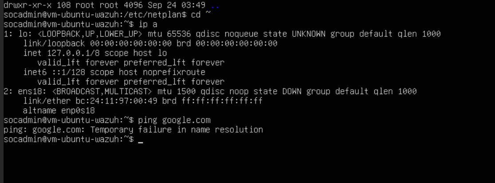

Manually forcing the link up confirmed the underlying virtual connection itself was fine:

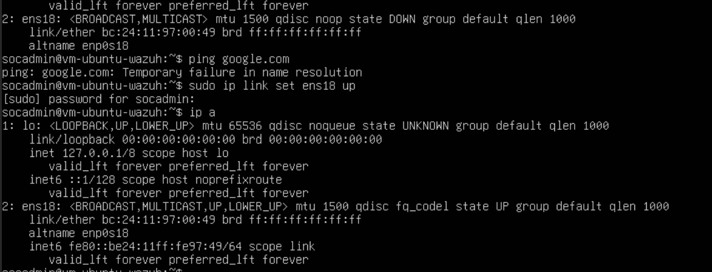

## Step 1 — Check the VM's own network configuration

No netplan configuration existed on the VM at all, explaining why nothing was requested automatically on boot:

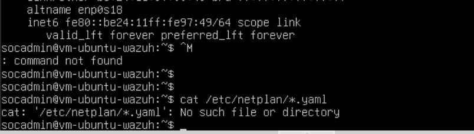

After creating a netplan config with `dhcp4: true`, the generated systemd-networkd file confirmed the setting was translated correctly:

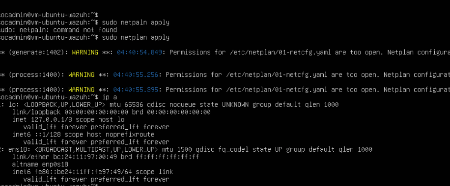

Yet the logs only showed DHCPv6 link-local activity — never a DHCPv4 lease:

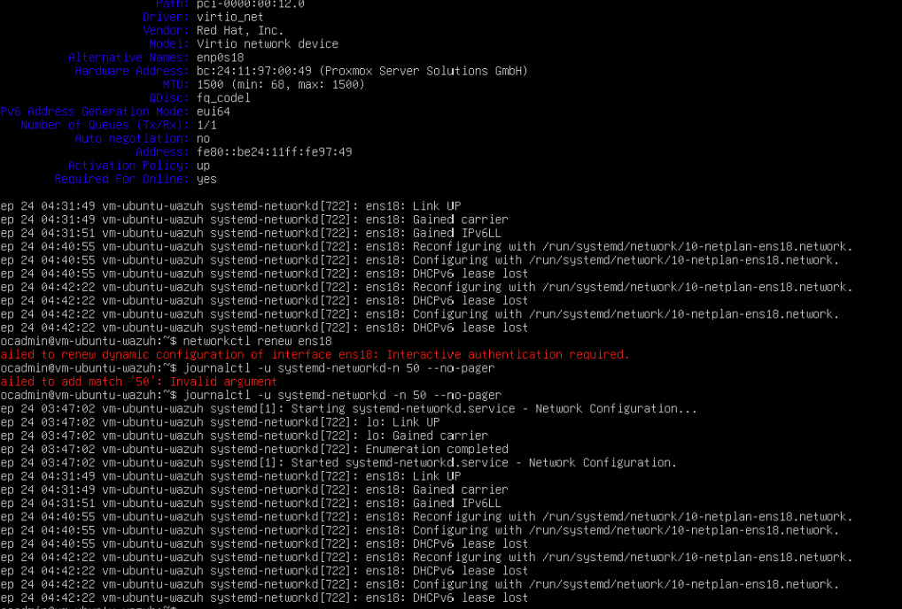

**Conclusion: the VM-side configuration was correct.** The problem was upstream.

## Step 2 — Check pfSense's DHCP server

pfSense's DHCP server for VLAN 30 (SOC) was enabled, with the correct pool and gateway — but had never issued a single lease:

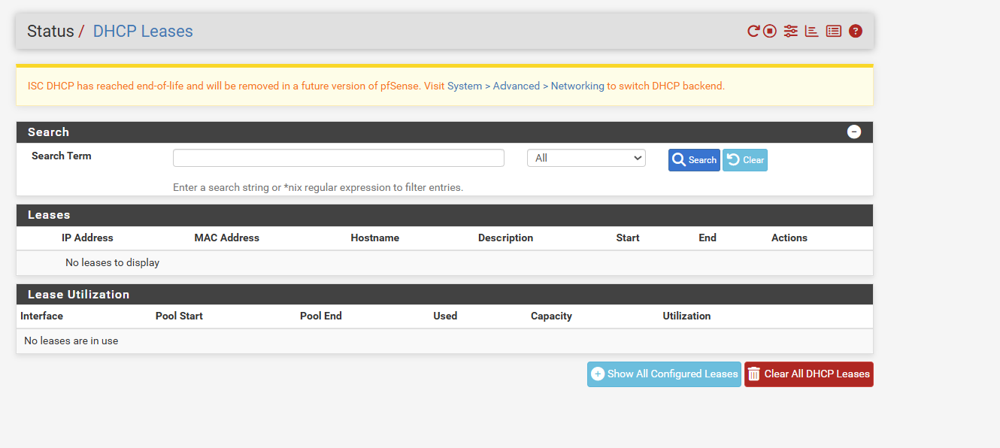

This ruled out a DHCP server misconfiguration and pointed to a problem in how traffic was reaching pfSense in the first place.

## Step 3 — Compare the VLAN/bridge configuration on both VMs

pfSense's LAN NIC was assigned as a trunk carrying all three VLANs:

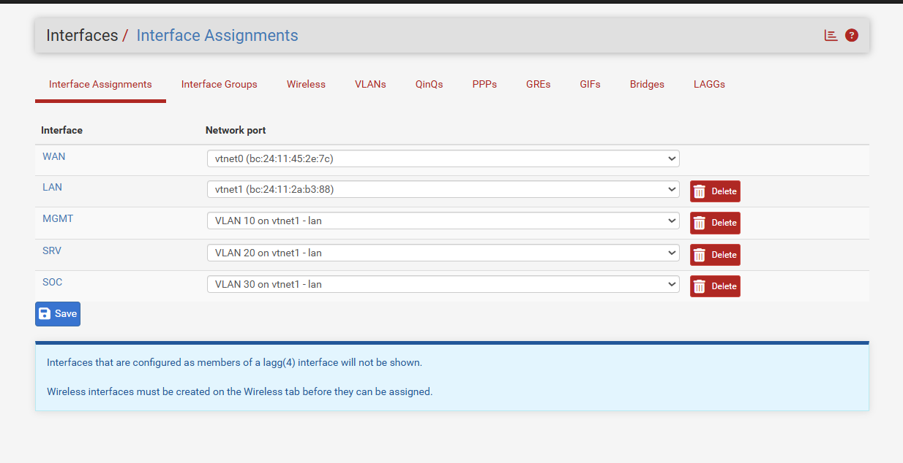

The Ubuntu VM's NIC was correctly tagged as an access port for VLAN 30:

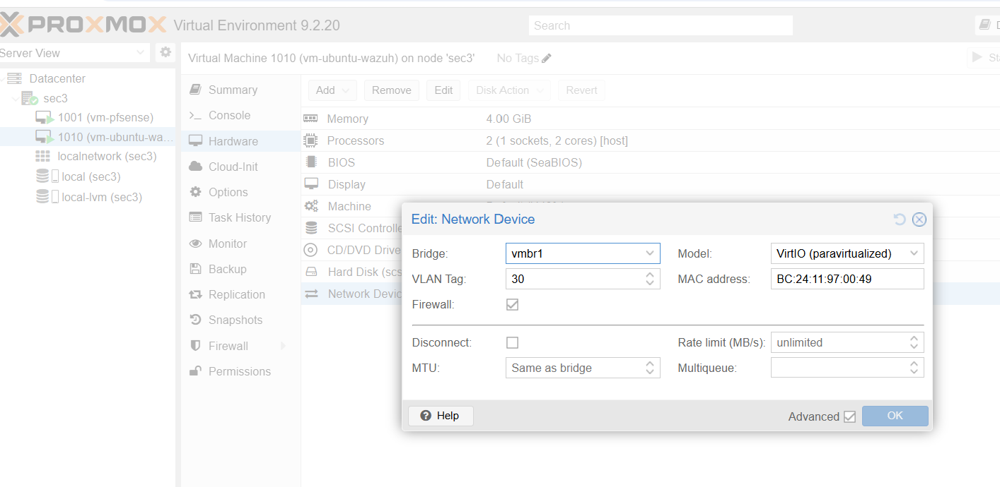

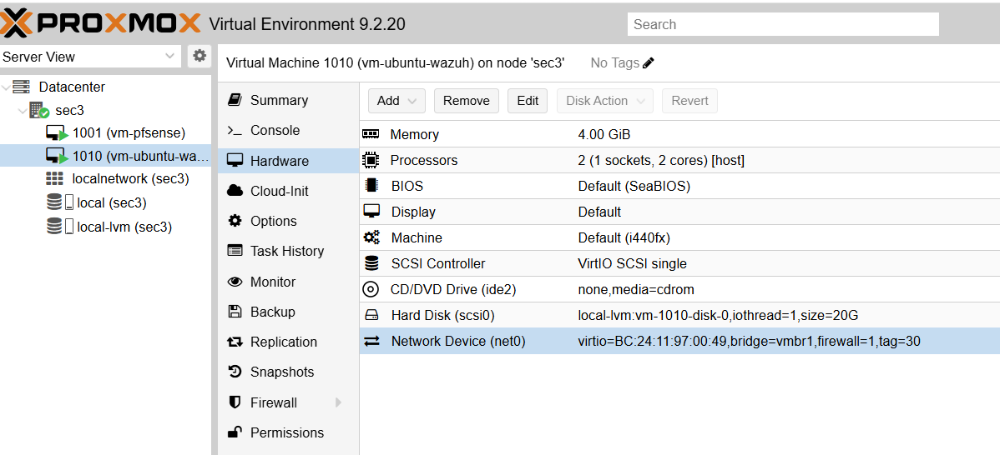

The underlying Proxmox bridge (`vmbr1`) was also confirmed to be VLAN-aware, with the full VLAN ID range allowed:

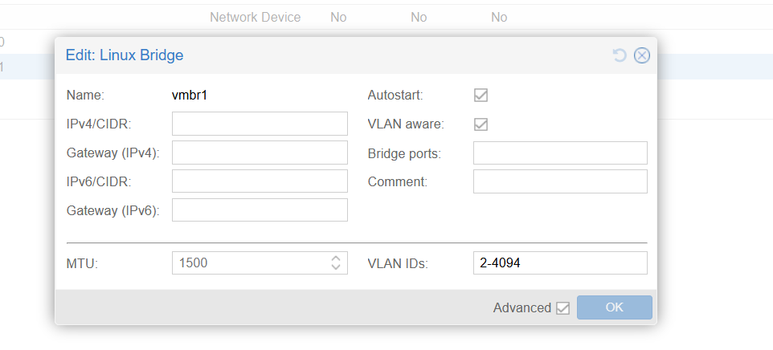

**On paper, everything was configured correctly.**

## Step 4 — Confirm whether any traffic was actually arriving

pfSense's ARP table had no record of the Ubuntu VM's MAC address on any interface:

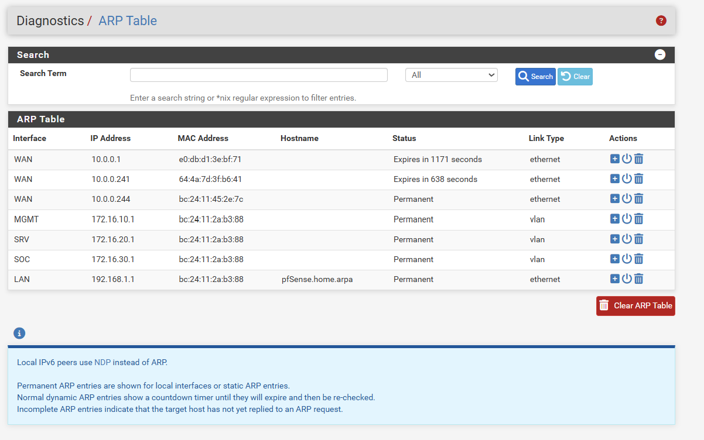

And the SOC interface's own packet counters confirmed it: zero inbound packets, ever.

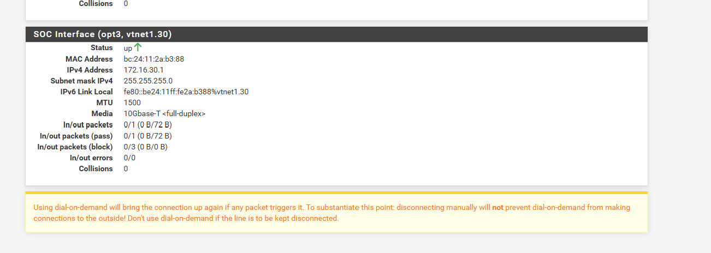

This meant the issue wasn't DHCP-specific at all — **no traffic of any kind was reaching pfSense from the Ubuntu VM.**

## Step 5 — Check the live kernel state of the bridge

With every layer of configuration confirmed correct in the UI, the only remaining explanation was that the *live* state didn't match the *configured* state. Running `bridge vlan show` directly on the Proxmox host confirmed it:

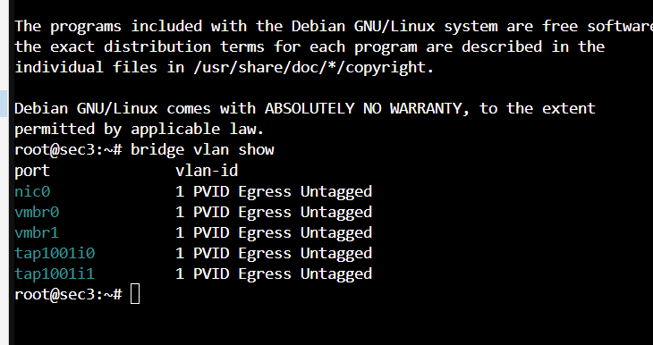

pfSense's own tap interfaces were still operating on the default, untagged VLAN 1 — not the VLAN trunk configuration shown in the UI.

## Root cause

**Enabling "VLAN aware" mode on a bridge, or applying a VLAN tag to a VM's NIC, only takes effect for tap interfaces created after the change.** Both VMs had been running through the configuration changes, so their existing tap interfaces retained the old, non-VLAN-aware state at the kernel level — a detail the Proxmox web UI never surfaces, since it only displays intended configuration, not live interface state.

## The fix

A full **stop and start** (not a reboot from inside the guest) of both VMs rebuilt their tap interfaces under the current bridge configuration.

After restarting pfSense, its trunk port correctly showed the full VLAN range:

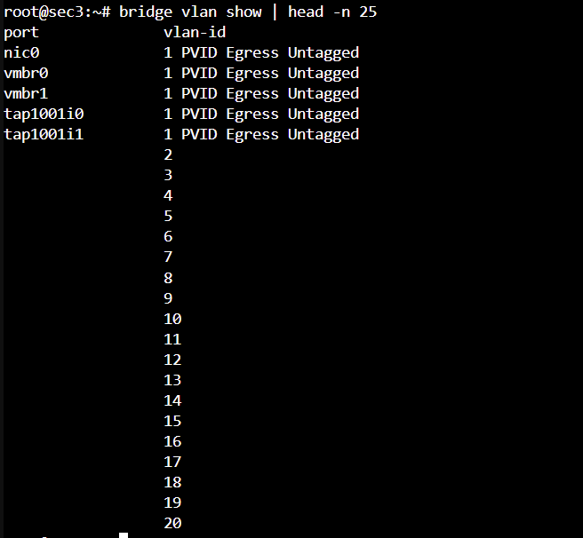

After restarting the Ubuntu VM, its port correctly showed VLAN 30 membership:

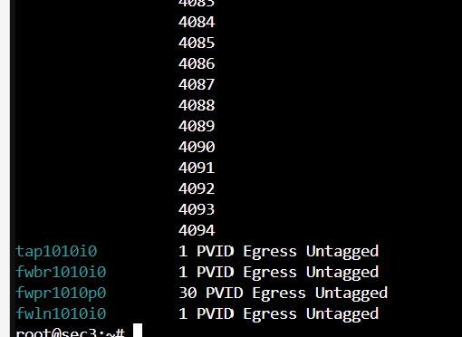

A fresh DHCP request from inside Ubuntu immediately succeeded:

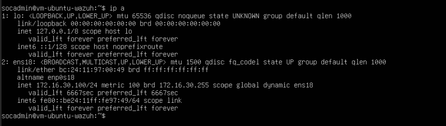

## Key takeaway

> Any time a Proxmox bridge's VLAN-aware setting, or a VM NIC's VLAN tag, is changed, **fully stop and start every VM attached to that bridge** — not just the one that was edited — to force their tap interfaces to be recreated under the new configuration. A running VM will not pick up bridge-level VLAN changes automatically, and the Proxmox web UI gives no warning that this step is needed.
